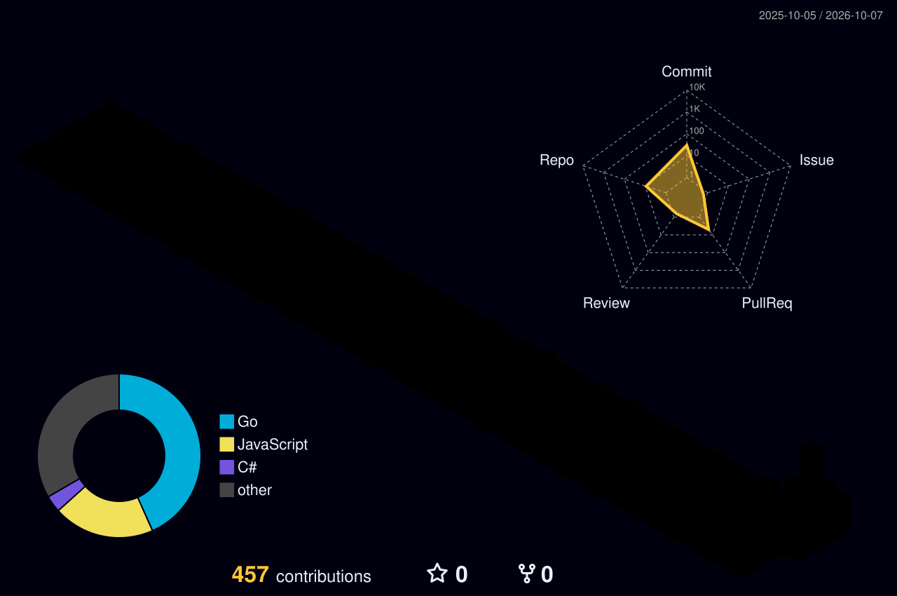

<!-- ============ Banner ============ -->
<p align="center">
  
</p>

<!-- ============ Typing ============ -->
<p align="center">
  <a href="https://github.com/AbuDergham">
    
  </a>
</p>

<!-- ============ Badges ============ -->
<p align="center">
  
  <a href="https://github.com/AbuDergham?tab=followers"></a>
  
</p>

<br/>

<!-- ============ About ============ -->
## 🧩 About me

<table>
<tr>
<td width="58%" valign="top">

- 🛍️ I build **business apps** for real shops & clinics — point-of-sale, debt tracking, clinic management, order tracking.
- 🌐 Everything is **Arabic-first & RTL**, made for the people and tools around me.
- 🖥️ I love **self-hosting**: Next.js behind Caddy, Docker, DuckDNS — full control, zero lock-in.
- 🛠️ I also craft **developer tools** — like [**Athar**](https://github.com/AbuDergham/Athar), a cross-agent AI-chat finder.
- 💬 Ask me about: Laravel · Next.js · Prisma · self-hosting · Arabic UX.

</td>
<td width="42%" valign="top">

```ts
const abuDergham = {
  role: "Full-stack dev",
  focus: ["Arabic-first", "self-hosted"],
  stack: ["TS", "Laravel", "Go"],
  db: ["PostgreSQL", "Prisma"],
  runs: "Next.js + Caddy + Docker",
  motto: "Ship it, own it.",
};
```

</td>
</tr>
</table>

<div align="right"><sub>ببني تطبيقات لأصحاب المحلات والعيادات — نقاط بيع، ديون، إدارة عيادات، متابعة طلبيات — كلها عربية RTL، وبفضّل الاستضافة الذاتية والتحكّم الكامل بالبيانات.</sub></div>

<br/>

<!-- ============ Tech ============ -->
## 🛠️ Tech stack

<p align="center">
  
</p>

<br/>

<!-- ============ Featured projects ============ -->
## 🚀 Featured projects

<p align="center">
  <a href="https://github.com/AbuDergham/Athar"></a>
  <a href="https://github.com/AbuDergham/Kashy"></a>
</p>
<p align="center">
  <a href="https://github.com/AbuDergham/asnani-releases"></a>
  <a href="https://github.com/AbuDergham/Debt-Manager"></a>
</p>

<br/>

<!-- ============ 3D contribution graph ============ -->
## 🧊 Contribution universe

<p align="center">
  
</p>

<!-- ============ Stats ============ -->
## 📊 GitHub stats

<p align="center">
  
  
</p>

<p align="center">
  
</p>

<!-- ============ Summary cards (extra insight) ============ -->
<p align="center">
  
</p>
<p align="center">
  
  
</p>

<!-- ============ Activity graph ============ -->
<p align="center">
  
</p>

<!-- ============ Trophies ============ -->
<p align="center">
  
</p>

<!-- ============ Snake ============ -->
<picture>
  <source media="(prefers-color-scheme: dark)" srcset="https://raw.githubusercontent.com/AbuDergham/AbuDergham/output/github-contribution-grid-snake-dark.svg" />
  <source media="(prefers-color-scheme: light)" srcset="https://raw.githubusercontent.com/AbuDergham/AbuDergham/output/github-contribution-grid-snake.svg" />
  
</picture>

<!-- ============ Dev quote ============ -->
<p align="center">
  
</p>

<!-- ============ Footer ============ -->
<p align="center">
  
</p>
<p align="center"><sub>⚡ Arabic-first software · self-hosted · privacy by default</sub></p>
